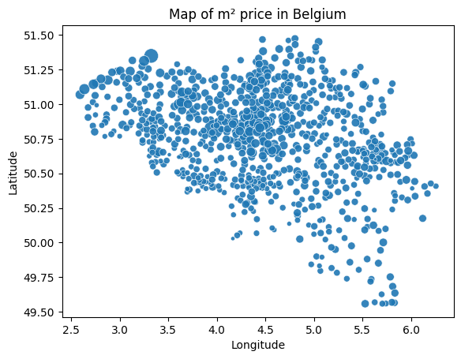
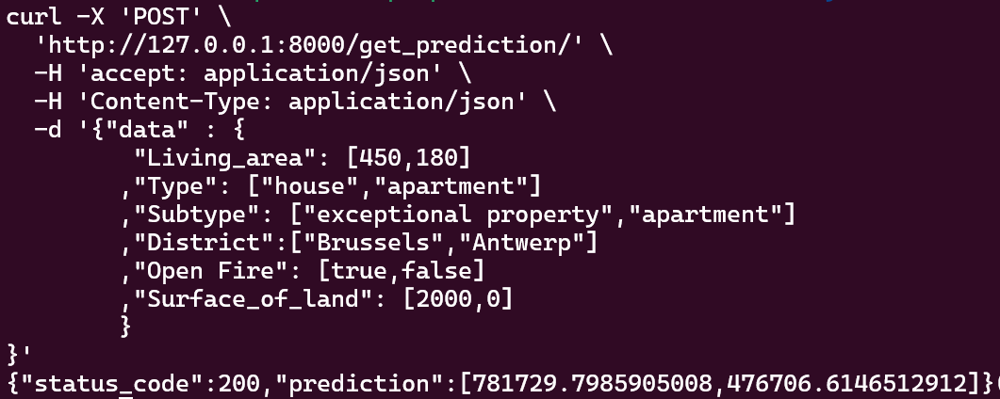

# From data analysis to deploying a predictive model

## Analyzing Data using pandas.

This repo uses pandas to analyze real estate data from Belgium. As the result of the analysis we build and deploy a prediction model for real estate prices in Belgium. The data was extracted from [immoweb](https://www.immoweb.be) using [this scraper](https://github.com/henrique-rauen/Wikipedia-Scraper)
 

## Installation

 
This repository contains the several steps required to go from analyzing a data set using pands to the deployment of a web app with a predictive model using Docker. 

In order to install all required libraries run `pip install -r requirements.txt`

## Usage

* Modelling
    1. Clone the repository to your local machine.
    2. Install the required dependencies mentioned in the installation section.
    3. This code assumes the presence of 2 csv files containing the data we want to analyze. Both are added in this repository, but if you want an updated version you can find the first one [here](https://github.com/henrique-rauen/Wikipedia-Scraper) and the second one can be downloaded [here](https://github.com/jief/zipcode-belgium/blob/master/zipcode-belgium.json). Both files must be in the data folder of this repository.
    4. If you want a high level overview, walk through the jupyter notebook `DataInformation.ipynb` inside the `data_exploration` folder.
    5. For a high level overview of the modelling you can check out the `Building.ipynb` jupyter notebook inside the `model_building` directory
    6. To run the samples outside of jupyter, run `src/explorations.py` for basic analysis and `src/modelling.py` for basic modelling.

* API
    1. In order to deploy the API using docker just build an image based on `Dockerfile` in the root directory of this repo (`docker build . -t immo-eliza-api`)
    2. run the docker container `docker run --name immo-eliza -v .:/app/ -p 80:80 immo-eliza-api`. That will run the API on localhost on port 80. Further documentation on the API can be found [here](https://github.com/henrique-rauen/BelgiumRealEstate/blob/main/docs/API.md)
    3. To stop the API run `docker stop immo-eliza` and to start again run `docker start immo-eliza`

## Context

This project was made by Henrique Rauen during 2 weeks as part of the becode AI operator training.
