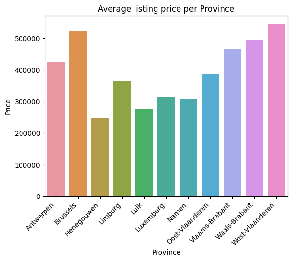
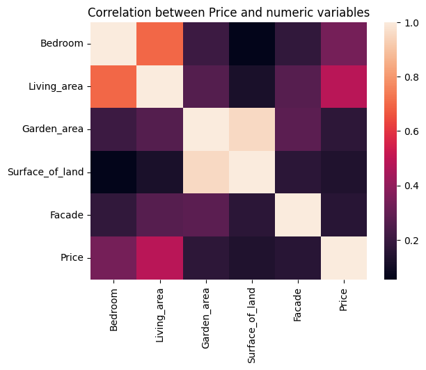
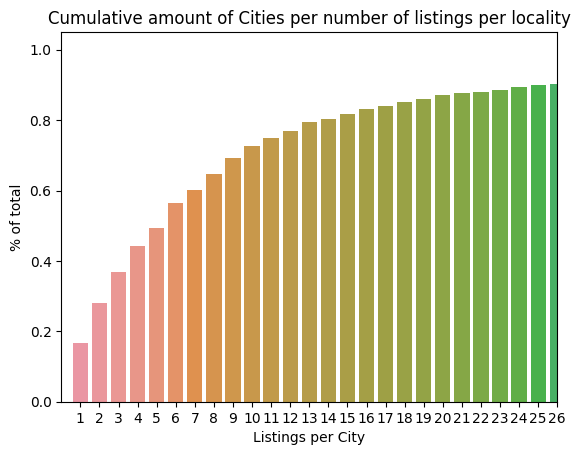
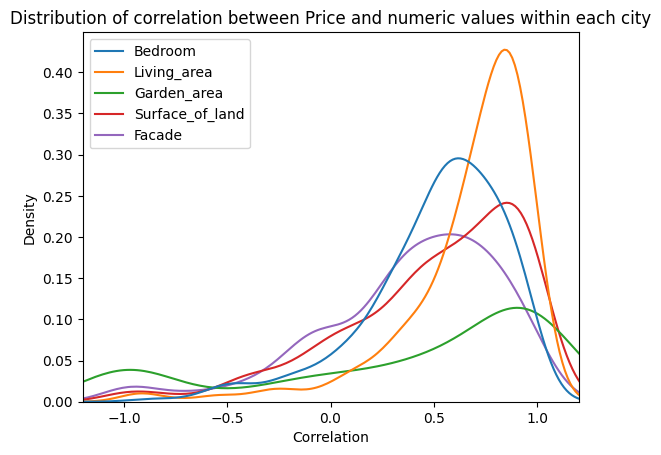

# Analyzing Data using pandas.

This repo uses pandas to analyze real estate data from Belgium. The end goal is to create a model capable of predicting real estate prices based on that data. The data was extracted from [immoweb](https://www.immoweb.be) using [this scraper](https://github.com/henrique-rauen/Wikipedia-Scraper)
 

## Installation

 
This repository contains a series of jupyter notebooks that walk you through analisys of the data and the creating of a predictive model based on that analysis.
It also contains .py files with all the tools required to work with the data and a sample analysis/modelling as well. You must also install the libraries described above.
You can install them manually using `pip install <library name>` or just running `pip install -r requirements.txt`.

## Usage

1. Clone the repository to your local machine.
2. Install the required dependencies mentioned in the installation section.
3. This code assumes the presence of 2 csv files containing the data we want to analyze. Both are added in this repository, but if you want an updated version you can find the first one [here](https://github.com/henrique-rauen/Wikipedia-Scraper) and the second one can be downloaded [here](https://github.com/jief/zipcode-belgium/blob/master/zipcode-belgium.json). Both files must be in the data folder of this repository.
4. If you want a high level overview, walk through the jupyter notebook `DataInformation.ipynb` inside the `data_exploration` folder.
5. For a high level overview of the modelling you can check out the `Building.ipynb` jupyter notebook inside the `model_building` directory
6. To run the samples outside of jupyter, run `src/explorations.py` for basic analysis and `src/modelling.py` for basic modelling.

## Context

This project was made by Henrique Rauen during 2 weeks as part of the becode AI operator training.
